# Debian DLBD镜像的下载

[TOC]

## 1：安装虚拟机

首先安装一个debian任意版本的虚拟机，`并给至少80G以上的硬盘空间，建议100G`，镜像大小接近50G，虚拟机需要20G左右，为避免其他各种原因，建议新装一个虚拟机来下载镜像

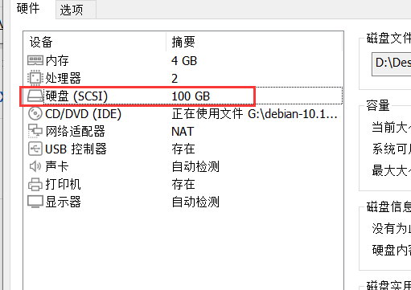

## 2：安装虚拟机

虚拟机的安装步骤与普通虚拟机安装一致即可

选择第二个安装，也可以选择第一个图形化安装

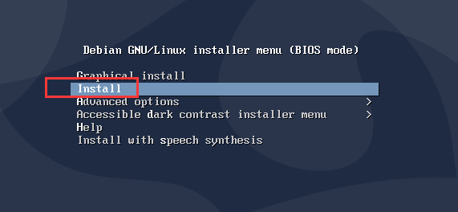

以下部分可以根据自己需求选择，我这里直接默认

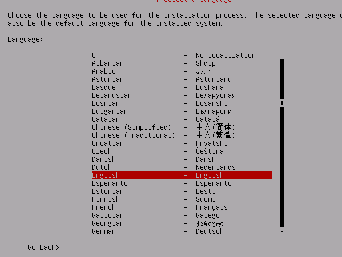

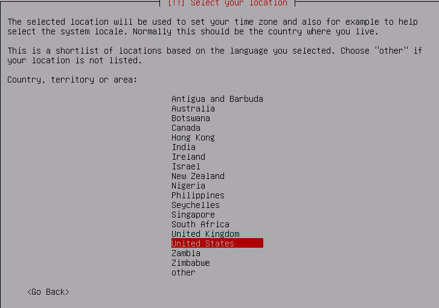

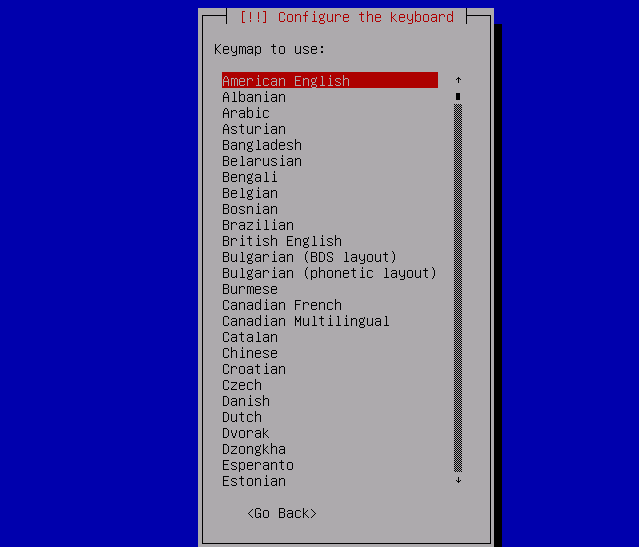

后续会自动DHCP获取网络，如果获取失败，可以选择不连接网络，安装完成后在进行配置

主机名

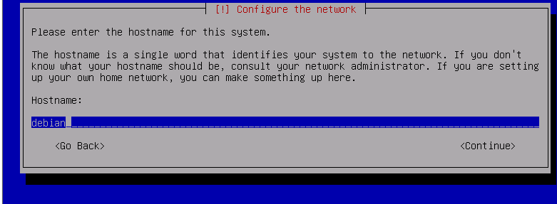

域名

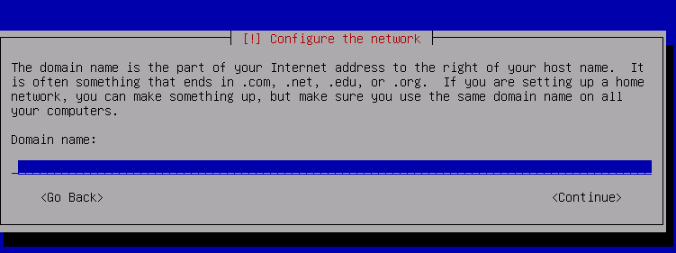

root密码

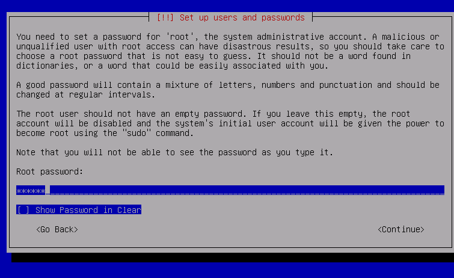

确认root密码

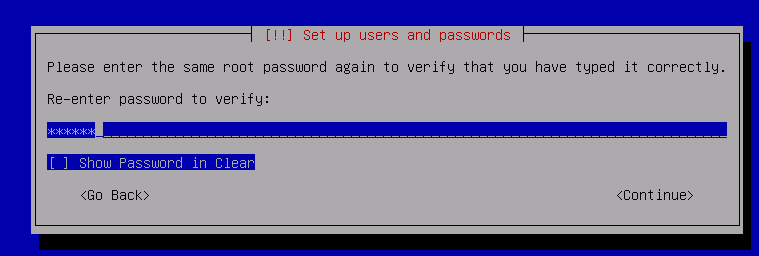

创建一个新用户

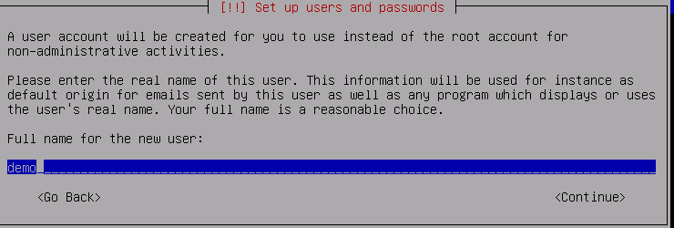

默认即可

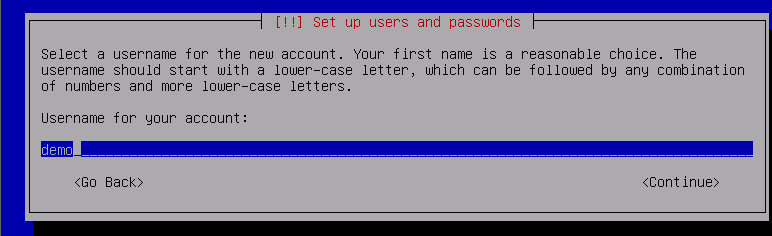

新用户密码

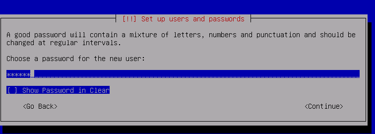

确认新用户密码

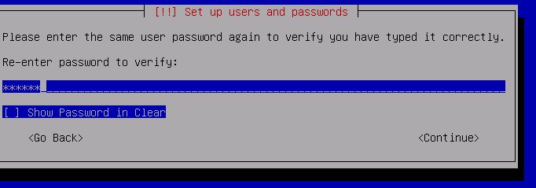

默认

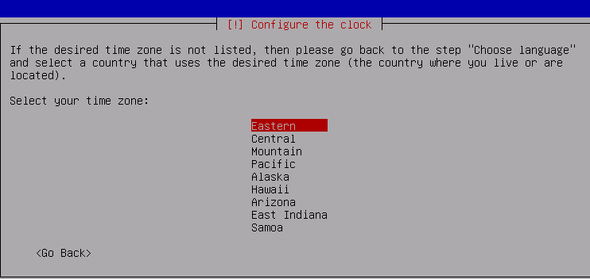

选择使用磁盘


默认

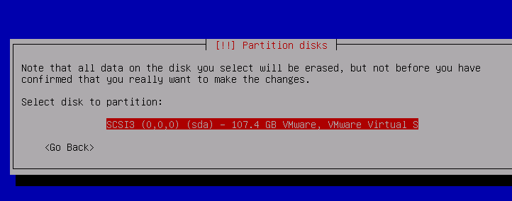、

选择一个分区

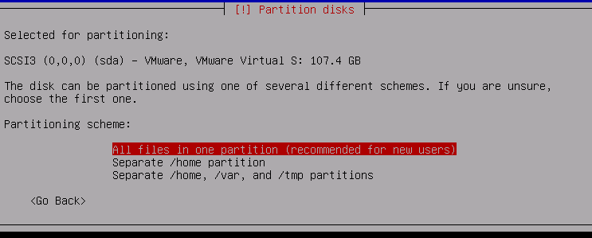

接受更改

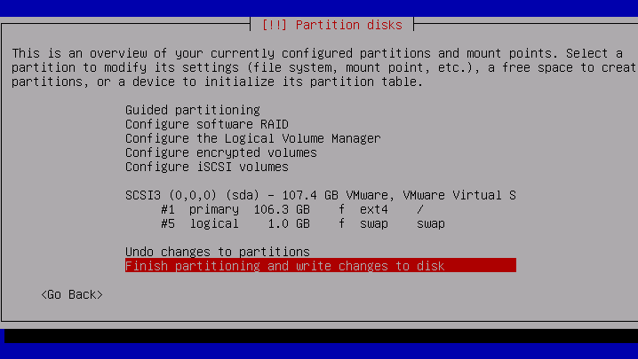

确定

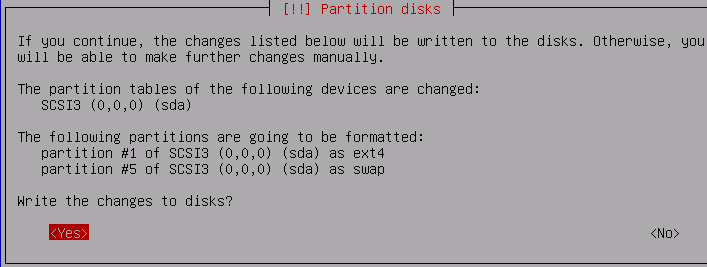

等待系统进行安装

不需要网络镜像源

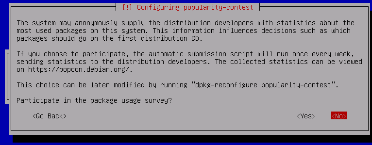

勾选桌面环境，桌面，ssh服务等（按空格选择取消）

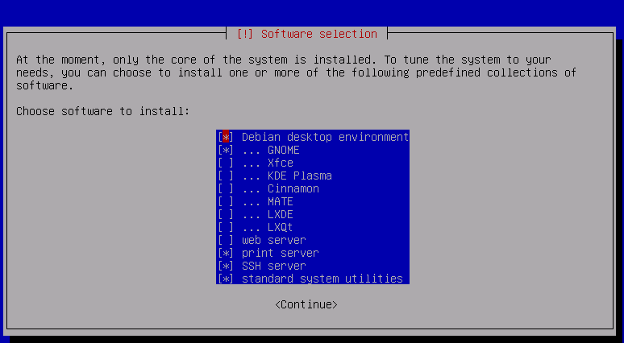

等待安装

选择yes

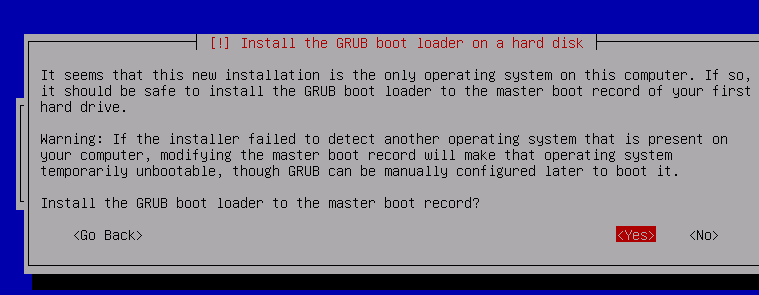

选择磁盘

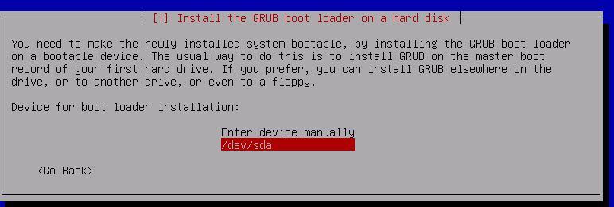

重启

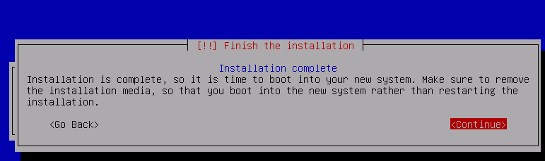

重启后进入图形界面，默认不能以root用户登录，需要以普通身份用户登录

按键盘上的徽标键或者点击active，搜索terminal并选择进入

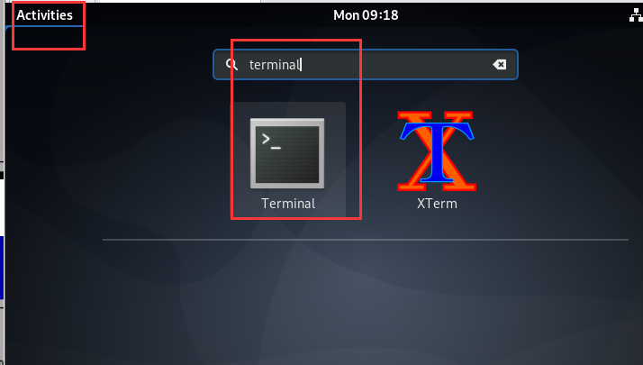

连接到光盘。默认即可安装软件，可以按照open-vmtools来协同物理机与虚拟机剪切板


## 3：配置网络

切换用户与软件安装

```bash
demo@debian:~$ su - root
Password: 
root@debian:~# 
root@debian:~# apt install open-vm-tools  //按安装vmtools工具
root@debian:~# apt install bash*  //如果命令无法补全安装，安装完成后重启
root@debian:~# apt install vim -y  //安装vim编辑器
```

配置网络

```bash
root@debian:~# ip addr  #查看网卡名称
```

查看网卡名称

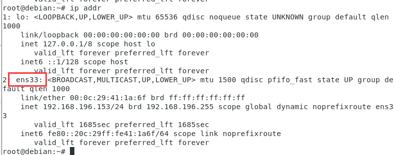

修改网络

```bash
root@debian:~# vim /etc/network/interfaces
auto ens33
iface ens33 inet static
address 192.168.196.152/24
gateway 192.168.196.2
dns-nameserver 223.5.5.5
root@debian:~# ping baidu.com -c 2  //ping测试，确保能通
```


## 4：配置apt源

进入[阿里开源镜像站](https://developer.aliyun.com/mirror/debian?spm=a2c6h.13651102.0.0.3e221b11ZapATm)，根据对应的debian版本选择源

debian10源如下

```bash
deb https://mirrors.aliyun.com/debian/ buster main non-free contrib
deb-src https://mirrors.aliyun.com/debian/ buster main non-free contrib
deb https://mirrors.aliyun.com/debian-security buster/updates main
deb-src https://mirrors.aliyun.com/debian-security buster/updates main
deb https://mirrors.aliyun.com/debian/ buster-updates main non-free contrib
deb-src https://mirrors.aliyun.com/debian/ buster-updates main non-free contrib
deb https://mirrors.aliyun.com/debian/ buster-backports main non-free contrib
deb-src https://mirrors.aliyun.com/debian/ buster-backports main non-free contrib
```


修改yum源

```bash
root@debian:~# vim /etc/apt/sources.list  //注销掉之前所有的内容
添加上面阿里的镜像源进去
root@debian:~# apt update  //更新源
```

将阿里的源放在最前

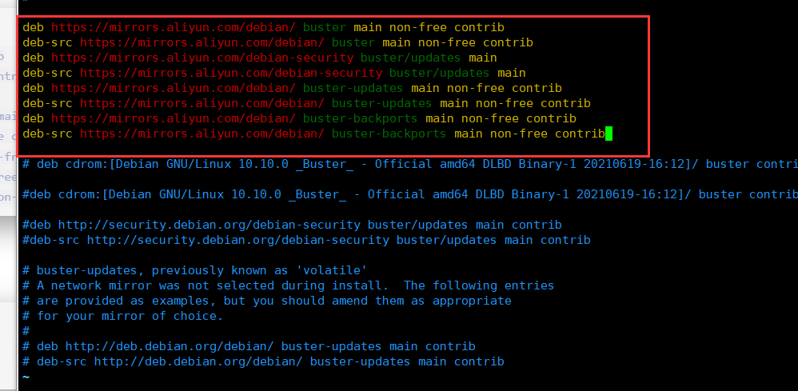

## 5：镜像下载

安装镜像下载工具

```bash
root@debian:~# apt install jigdo-file -y
```

进入阿里下debian的镜像仓库，进入[debian镜像源](https://mirrors.aliyun.com/debian-cd/current/amd64/jigdo-dlbd/)

找到我们所需要的文件，右键复制连接[debian-11.5.0-amd64-DLBD-1.jigdo](https://mirrors.aliyun.com/debian-cd/current/amd64/jigdo-dlbd/debian-11.5.0-amd64-DLBD-1.jigdo?spm=a2c6h.25603864.0.0.2344718fawq4DO)

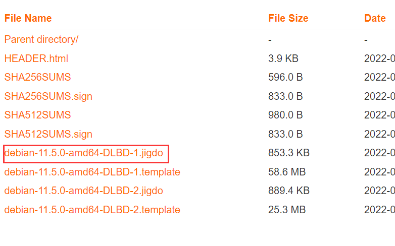

运行程序

```bash
root@debian:~# jigdo-lite    //运行程序

Jigsaw Download "lite"
Copyright (C) 2001-2005  |  jigdo@
Richard Atterer          |  atterer.org
Getting mirror information from /etc/apt/sources.list

-----------------------------------------------------------------
To resume a half-finished download, enter name of .jigdo file.
To start a new download, enter URL of .jigdo file.
You can also enter several URLs/filenames, separated with spaces,
or enumerate in {}, e.g. `http://server/cd-{1_NONUS,2,3}.jigdo'
jigdo: https://mirrors.aliyun.com/debian-cd/current/amd64/jigdo-dlbd/debian-11.5.0-amd64-DLBD-1.jigdo?spm=a2c6h.25603864.0.0.2344718fawq4DO   //粘贴我们复制的debian-11.5.0-amd64-DLBD-1.jigdo地址回车

Alternatively, just press enter if you want to start downloading
the remaining files.
Files to scan:    //直接回车

States', or a server name like `sunsite'.
Debian mirror [https://mirrors.aliyun.com/debian/]:    //镜像源地址，如果不是阿里的就复制阿里的镜像源地址粘贴回车即可
```

后续则等待自动下载整合即可，中途不能断网，关机，挂起等操作。容易出现问题

下载的时间比较长，具体根据当前网速来确定

## 扩展

允许root用户桌面环境直接登录

```bash
root@debian:~# vim /etc/pam.d/gdm-password 
#%PAM-1.0
auth    requisite       pam_nologin.so
auth	required	pam_succeed_if.so user = root quiet_success   //去掉=之前的!即可，重启生效
```

允许远程ssh以root身份登录

```bash
root@debian:~# vim /etc/ssh/sshd_config 
#LoginGraceTime 2m
#PermitRootLogin prohibit-password   //去掉#号并将prohibit-password修改为yes
#StrictModes yes
#MaxAuthTries 6
#MaxSessions 10
***********************************************************************
修改后

#LoginGraceTime 2m
PermitRootLogin yes  //修改后
#StrictModes yes
#MaxAuthTries 6
#MaxSessions 10
root@debian:~# systemctl restart ssh  //重启ssh服务即可
```

